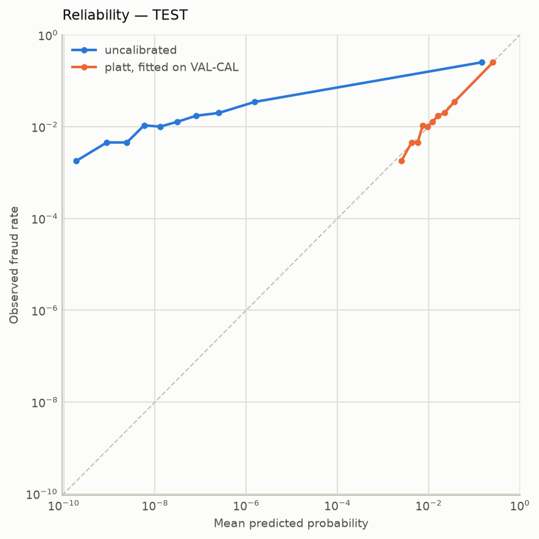
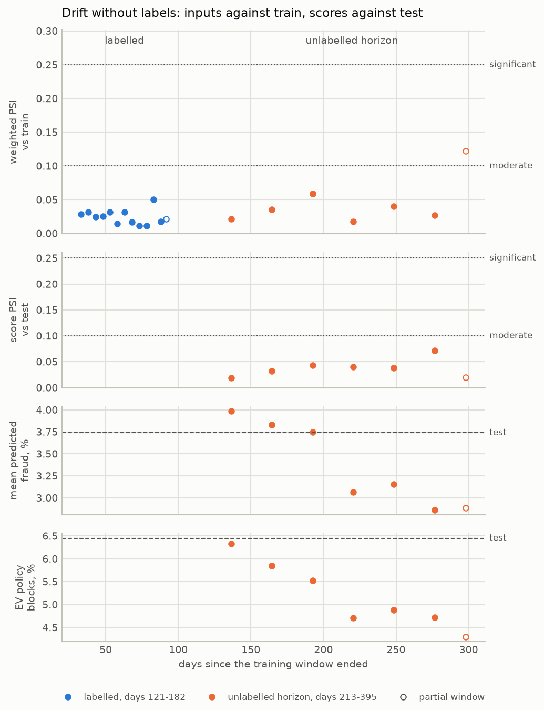

# fraud-decision-engine

Turns transaction fraud probabilities into cost-weighted **allow / review / block**
decisions on the IEEE-CIS dataset, and reports the result in dollars saved against the
rules engine it replaces — not in AUC.

## The result

Test set, days 161–182, scored **once**: 61,585 transactions, 2,277 of them fraudulent
(3.70%). Every input was frozen and committed before a test row was scored.

| policy | USD lost per 1,000 transactions | reviews / day | blocked | vs. rules engine |
|---|---:|---:|---:|---:|
| allow everything | 6,618 | 0 | 0% | +3.8% |
| **rules engine** (the incumbent) | **6,373** | 27.45 | 0% | — |
| model, fixed 0.5 threshold | 5,155 | 0 | 1.77% | −19.1% |
| model, expected-value policy on uncalibrated scores | 4,840 | 18.64 | 1.23% | −24.1% |
| **model, expected-value policy** | **2,481** | 27.45 | 6.45% | **−61.1%** |

**The expected-value policy saves $3,892 per 1,000 transactions against the rules
engine.** Changing one thing at a time says where it comes from:

- **The model behind one fixed cut: 19.1%.**
- **A threshold per transaction, priced against its own amount: 61.1%**, on the same
  probabilities — 42 points more.
- **The same policy on uncalibrated scores: 24.1%**, so calibration is worth 37 points.

Both levers outrank the model on its own.

**What it costs.** The policy blocks 6.45% of transactions and 67% of those are
legitimate — 4.5% of good customers declined, at an assumed $15 each. That is the
weakest assumption in the project, so it was swept from $5 to $100 on validation: the
advantage stayed between 34% and 69%. Part of the margin is structural — a rules engine
emits points, not probabilities, so it can only review and never blocks.

**What it rests on.** Most of the signal is inherited. The dataset ships several hundred
aggregates (`C*`, `D*`, `V*`) that Vesta computed over lookback windows it never
published. They carry **57.2%** of the model's contribution mass on test, and keeping
only the 54 columns a team could rebuild retains **53.8%** of PR-AUC in the ablation's
reference configuration. The pipeline is clean and tested; the exposure is the
dataset's, and it belongs at the top rather than in the limitations.

## The problem

A payment processor decides, inline with authorisation, what to do with each
transaction:

| action | cost when wrong |
|---|---|
| **allow** | a fraud costs its amount plus a $25 chargeback fee |
| **review** | friction on a good customer, plus analyst time |
| **block** | a legitimate customer refused |

Two constraints: **p95 latency under 100 ms**, and **review capacity of 1% of daily
volume** — about 32 cases a day, one analyst for an hour or two.

A missed fraud costs an amount that scales with the transaction; a false decline costs
roughly a fixed amount. So blocking pays above a probability that depends on the amount:

```
p* = C_fp / (amount + chargeback_fee + C_fp)
```

At the assumed costs a $20 transaction is blocked above 25.0% and an $8,000 one above
0.187%. One global threshold is the wrong instrument, which is why this project reports
money. Review is the third action: a transaction is eligible when reviewing it beats the
better of allow and block in expectation, and each day the largest savings take the
seats.

Everything is in USD, as `TransactionAmt` is. The reasoning and each cost's provenance:
[`docs/problem-statement.md`](docs/problem-statement.md); the assumptions are versioned
in [`config/cost_matrix.yaml`](config/cost_matrix.yaml).

## How it was evaluated

The labelled IEEE-CIS file: 590,540 transactions over 182 days, 3.50% fraud. Split in
time, never at random:

```
day   1 ────────── 90 │ 91 ──── 120 │ 121 ── 140 │ 141 ── 160 │ 161 ── 182
         TRAIN        │   PURGED    │  VAL-FIT   │  VAL-CAL   │    TEST
```

- **A 30-day label-maturity purge.** Fraud is confirmed by a chargeback weeks later, so
  training right up to validation assumes labels that would not exist yet. Measured on
  validation, an evaluation without the purge would have claimed **$280–$355 more
  saving per 1,000**, both intervals clear of zero.
- **Validation in two.** `VAL-FIT` drives early stopping and tuning; `VAL-CAL`, later in
  time, fits the calibrator and rehearses the policy, so the calibrator never sees rows
  the model stopped against.
- **Test touched once, structurally.** The stage that scores it refuses a dirty tree and
  refuses to run twice, and a reloaded model must reproduce its recorded validation
  scores exactly before it scores anything new.
- **Decisions registered before their numbers.** Every choice that could move a reported
  figure was written down with its reading rule first:
  [`decision-policy.md`](docs/decision-policy.md),
  [`explainability.md`](docs/explainability.md), [`serving.md`](docs/serving.md),
  [`monitoring.md`](docs/monitoring.md). Experiments are in
  [`experiments.md`](docs/experiments.md).

## Model and baselines

| | `VAL-FIT` PR-AUC | `VAL-CAL` PR-AUC | recall at 1% capacity, `VAL-CAL` |
|---|---:|---:|---:|
| rules engine (the incumbent) | 0.128 | 0.094 | 4.3% |
| logistic regression (the reference) | 0.322 | 0.229 | 13.9% |
| **LightGBM, tuned (shipped)** | **0.589** | **0.521** | **26.2%** |

A perfect ranker catches 31.1% on `VAL-CAL` at that capacity: at 1% of daily volume the
limit is the seat count, not the model.

- **Tuning had to clear a bar.** The best of sixty Optuna trials on `VAL-FIT` is partly
  the luckiest, so the winner was accepted only because its gain over the untuned model
  (0.069) was eight times the spread seed changes alone produce.
- **Imbalance handling lost.** Class weighting scored below doing nothing, and SMOTE
  below the same pipeline without it.
- **No hand-built feature family clears its own noise bar** when removed from the
  model. The signal is in the inherited columns, as the result above says.

## Calibration

The booster ranked well and lied about magnitude: its uncalibrated log-loss on
`VAL-CAL` was worse than predicting the base rate for everyone. **Platt scaling shipped,
by a rule written before the numbers** — isotonic had to beat it in every fold and won
two of four. Expected calibration error, out of fold, fell from 0.0210 to 0.0018.

**It held on test**: expected calibration error 0.0016, mean predicted fraud 3.74%
against 3.70% observed, PR-AUC 0.515 against 0.521 on `VAL-CAL`. At 1% capacity the
model catches 22.1% of test fraud against the rules engine's 5.0%.



## Explainability

A person subject to an automated decision can ask why (LGPD, BACEN guidance). Here the
answer is partly *no one can say*.

- **36.2% of declines have only a generic reason**, in a sample of 10,000 test
  transactions: none of their three leading contributors has a published definition,
  so the honest notice is that pre-computed indicators argued against the transaction.
- **Explaining costs about sixty times scoring**: ~900 ms at p95 against ~16 ms, and
  more threads made it slower. Reason codes therefore live on their own endpoint.
- **The hypotheses failed in an instructive way.** Three were registered before any
  model. Their claims about fraud mostly held on test; every prediction about how the
  model would use the field failed — `ProductCD` ranks #70 of 349 — because a booster
  whose columns repeat the same signal does not use a field in proportion to how well it
  separates fraud alone.

Record: [`docs/explainability.md`](docs/explainability.md).

## Serving

A FastAPI service in a container: `POST /score`, `GET /health`, `POST /explain`. The
433-field contract is derived from the booster at startup, so it cannot drift from the
model, and an omitted field is a null, as it is in the data.

- **Features that need live card history are served with their no-history defaults.**
  Measured on `VAL-CAL`, that costs +$56 per 1,000 with a 95% interval of [−$18, +$124]:
  it cannot be shown to cost anything.
- **The p95 budget is met at one and two requests in flight** (31 ms and 79 ms on one
  worker) **and missed from four.** The real operating point is 0.032 requests per
  second. Past the knee throughput *falls*, because a breach releases the caller but a
  prediction cannot be interrupted.
- **It fails open to the rules engine**, and `/health` counts the fallbacks. The image
  refuses to build without its ten artifacts and carries neither `shap` nor
  `matplotlib`.

Record, with the full latency table: [`docs/serving.md`](docs/serving.md).

## Monitoring

Labels arrive 30 days late, so **a monitor that needs labels is always a month behind.**
Two horizons: the labelled days 121–182 in five-day windows, and Kaggle's unlabelled
file, days 213–395, in 28-day windows — scored by the shipped model as the service
would, after the same path reproduced test's matrix and scores to the bit.

**Measurement is unlimited; tuning is spent once.** Test was touched once to *decide*,
and is re-read here window by window to *measure*. No threshold, parameter or feature
moved because of anything in this section.

- **No test window declines.** None is shown to fall below `VAL-CAL`'s PR-AUC with
  day-level bootstrap intervals; the one window flagged lies inside `VAL-CAL` itself.
- **The inputs the model leans on held.** Contribution-weighted PSI stayed stable in
  every full window of both horizons. What moved is in columns it barely uses: fields
  that started arriving (`M1`–`M3`, `M7`–`M9`, `D11`) and browser versions the
  vocabulary never saw.
- **The policy moved anyway.** Score PSI stayed stable while the frozen policy blocked a
  quarter less (6.33% → 4.72%) and mean predicted fraud fell from 3.98% to 2.86%. The
  change is in the top tail, which decile PSI cannot see. Without labels, "fraud fell"
  and "the model under-calls" cannot be told apart, and neither is chosen.
- **The retraining rule fires only on its 90-day cadence.** Registered before the run
  and replayed on the records, its labelled condition could judge no window, and its
  label-free ones stayed silent through the one change that reached the policy. That
  blind spot is reported, not tuned away. A retrain
  triggered then trains, under this project's own layout, on data ending 100 days
  earlier.



Record: [`docs/monitoring.md`](docs/monitoring.md); the labelled decay chart is
[`reports/figures/decay_pr_auc.png`](reports/figures/decay_pr_auc.png).

## Limitations

- **`isFraud = 0` means nobody disputed it**, so every metric is measured against an
  under-count of fraud.
- **Most of the signal is vendor aggregates over undisclosed windows.** The purge
  protects the labels, not features computed with information from beyond the training
  window.
- **The $15 false-decline cost is assumed.** The conclusion survives $5–$100; its size
  does not.
- **The policy declines 4.5% of good customers**, which a merchant would weigh as a
  constraint, not only a cost.
- **The incumbent cannot block**, so part of the margin is structural.
- **30 days of label maturity is a judgement**; card networks allow about 120 to dispute.
- **There is no purge before deployment.** The calibrator used `VAL-CAL` labels that
  would mature 30 days after it ends; the test replay treats them as known the next day.
- **The labelled evaluation spans 22 days**, so a monthly labelled decay chart was never
  possible, and five-day windows are noisy.
- **A system cannot detect drift in a feature it defaults.** The live-history columns
  are defaulted in serving, so PSI cannot see them move.
- **A US e-commerce ticket distribution.** Decision rates would not transfer; the method
  would.

## What I'd do next

- **Monitor what the policy acts on**: a trigger condition on its block rate and the
  score tail, threshold fixed before any horizon is read — the change the registered
  rule could not see.
- **Shed load on queue depth**, so a request in breach stops costing the server both the
  model and the fallback.
- **A per-card feature store**, to serve the live-history columns properly, monitor them,
  and give their value a fair test.
- **A second purge before deployment and a longer labelled window**, so decay is
  measured monthly and with labels.

## Running it

```bash
uv sync                                      # install from the lockfile
make download                                # Kaggle CLI; needs ~/.kaggle/access_token
make data splits features train calibrate    # raw CSVs to the frozen model and calibrator
make headline                                # the one test touch; refuses once recorded
make decay horizon drift trigger             # monitoring, both horizons
make image serve                             # the API on port 8000
make check                                   # ruff and pytest
```

`make help` lists every stage. Raw data is checksum-enforced, and each stage reruns only
when its inputs or its config section change.

## Repository layout

```
config/             run settings, cost assumptions, the reason-code dictionary
src/fraud_engine/
  data/             loading, schemas, temporal splits
  features/         feature families and their serving tiers
  models/           rules engine, logistic, LightGBM, calibration, experiments
  evaluation/       metrics, cost policies, the single test touch
  explain/          contributions, reason codes
  serving/          the API, its transform and its fallback
  monitoring/       windows, PSI, decay, drift, the retraining trigger
tests/              the suite `make check` runs
docs/               the records each section above links to
reports/            metrics and figures, tracked as deliverables
notebooks/          exploration only, never the pipeline
```

Each stage reads the previous stage's output from disk and writes its own, so any stage
reruns in isolation, and encoders fitted on training data live where only training data
reaches them.
